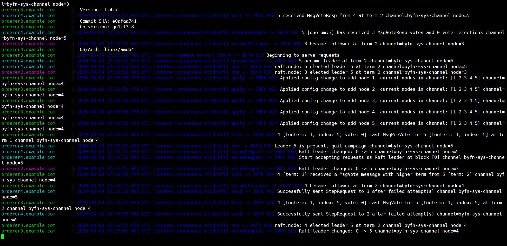

# Fabric 1.4.7 MVC web

## 1.目标：基本的网络

排序方式：etcdraft

网络名称：byfn

应用通道名：mychannel  

系统通道名：byfn-sys-channel

| 组织    | 包含节点                                                     |
| ------- | ------------------------------------------------------------ |
| Orderer | orderer.example.com:7050<br />orderer1.example.com:8050<br />orderer2.example.com:9050<br />orderer3.example.com:10050<br />orderer4.example.com:11050 |
| Org1    | peer0.org1.example.com:7051<br />peer1.org1.example.com:8051<br />ca.org1.example.com:7054<br />cli:7051 |
| Org2    | peer0.org2.example.com:9051<br />peer1.org2.example.com:11051<br />ca.org2.example.com:8054<br /> |

## 2.项目目录


## 3.准备工作

### `3.1创建项目目录`

```shell
mkdir -p $GOPATH/src/github.com/KangChain.com/KangChain/demo0/channel-artifacts
cd $GOPATH/src/github.com/KangChain.com/KangChain/demo0
创建网络配置中的所有目录
```

### `3.2将fabric-samples/bin添加到环境变量。`

注意这个目录要有cryptogen和configtxgen工具，添加到环境变量作用是可以在任意目录下使用这些工具。

```shell
export PATH=/home/ubuntu/Desktop/fabric-samples/bin:$PATH
```

export PATH=/home/ubuntu/fabric-samples/bin:$PATH

这样可以在其他目录使用`Cryptogen`和`Configtxgen`

### `3.3将当前登录用户添加到docker组`

这样可以免去管理员执行docker命令

```
sudo usermod -aG docker ubuntu
```

重启

### `3.4初始化并启动CA服务器`（实际上并没有用到CA，此部分先忽略）

CA的作用是注册证书，证书代表身份。

#### `若没有安装，先安装CA服务器和客户端`

安装依赖

```
sudo apt install libtool libltdl-dev
```

安装服务端与客户端

```
go get -u github.com/hyperledger/fabric-ca/cmd/...
```

确定服务器主目录

```
cd ~
mkdir fabric-ca && cd fabric-ca
```

#### `初始化和启动`

```
fabric-ca-server init -b admin:adminpw --ca.certfile org1.example.com/ca.org1.example.com-cert.pem
```

```shell
#移动msp文件夹到org1.example.com文件夹下。
mv msp org1.example.com
```

```
fabric-ca-server init -b admin:adminpw --ca.certfile org2.example.com/ca.org2.example.com-cert.pem
```

```
mv msp org2.example.com
```

启动后目录如下：

<pre><font color="#729FCF"><b>.</b></font>
├── fabric-ca-server-config.yaml
├── fabric-ca-server.db
├── IssuerPublicKey
├── IssuerRevocationPublicKey
├── <font color="#729FCF"><b>org1.example.com</b></font>
│   ├── ca.org1.example.com-cert.pem
│   └── <font color="#729FCF"><b>msp</b></font>
│       └── <font color="#729FCF"><b>keystore</b></font>
│           ├── 661ba98ffeb10bc055e93ed18b40ec2d05b67689a5c1d65c77b34760bd52338b_sk
│           ├── IssuerRevocationPrivateKey
│           └── IssuerSecretKey
└── <font color="#729FCF"><b>org2.example.com</b></font>
    ├── ca.org2.example.com-cert.pem
    └── <font color="#729FCF"><b>msp</b></font>
        └── <font color="#729FCF"><b>keystore</b></font>
            ├── ab89ce80cc824d2ea79a2077e8ee88709819f418a4e3ae0cbb1fb42db6804c2e_sk
            ├── IssuerRevocationPrivateKey
            └── IssuerSecretKey


初始化结束后，修改docker-compose-base.yaml 中ca的指定私钥和证书的部分。2个CA容器都要修改。可以直接修改，也可以设置变量，在.env文件中设置。推荐使用变量的方式。

```
- FABRIC_CA_SERVER_CA_CERTFILE=/etc/hyperledger/fabric-ca-server-config/org1.example.com/ca.org1.example.com-cert.pem
- FABRIC_CA_SERVER_CA_KEYFILE=/etc/hyperledger/fabric-ca-server-config/org1.example.com/msp/keystore/${ca_org1_sk}
```

```
- FABRIC_CA_SERVER_TLS_CERTFILE=/etc/hyperledger/fabric-ca-server-config/org1.example.com/ca.org1.example.com-cert.pem
- FABRIC_CA_SERVER_TLS_KEYFILE=/etc/hyperledger/fabric-ca-server-config/org1.example.com/msp/keystore/${ca_org1_sk}
```

.env

```
ca_org1_sk=661ba98ffeb10bc055e93ed18b40ec2d05b67689a5c1d65c77b34760bd52338b_sk
ca_org2_sk=ab89ce80cc824d2ea79a2077e8ee88709819f418a4e3ae0cbb1fb42db6804c2e_sk
```

## 4.配置文件部分


### 4.1 crypto-config.yaml

该文件是cryptogen工具的配置文件，用于配置所有的组织信息。

```yaml
#Orderer组织的配置部分
OrdererOrgs:
  	#Name指定组织的名字
  - Name: OrdererOrg
  	#完整的域名是 Hostname.Domain
    Domain: example.com
    #如果设置了EnableNodeOUs，就在该组织的msp目录下生成config.yaml文件
    EnableNodeOUs: true
    Specs:
      - Hostname: orderer
      - Hostname: orderer2
      - Hostname: orderer3
      - Hostname: orderer4
      - Hostname: orderer5
#Peer组织的配置部分   
PeerOrgs:
  - Name: Org1
    Domain: org1.example.com
    EnableNodeOUs: true
    #Template是一个模板。会按顺序创建从0到count-1个peer，默认第一个Hostname是peer0,最后一个Hostname是peer[count-1]。 可以设置起始索引（Start）
    Template:
      Count: 2
      # Start: 5
    #Users是除了Admin用户的数量
    Users:
      Count: 1
  - Name: Org2
    Domain: org2.example.com
    EnableNodeOUs: true
    Template:
      Count: 2
    Users:
      Count: 1
```

### 4.2 configtx.yaml

该文件是configtxgen工具的配置文件，用于生成4个文件

- [x] 系统通道的创世区块
- [x] 应用通道的事务配置文件
- [x] 组织1的锚节点更新配置文件
- [x] 组织2的锚节点更新配置文件

```yaml
################################################################################
#
#   Section1: Organizations
#
################################################################################
Organizations:
	# &OrdererOrg将这部分设置可以引用，下面的*OrdererOrg相当于把这部分直接拿过来。
  	#这个名称在这里只是引用没有实际意义
  - &OrdererOrg
  	#组织名
    Name: OrdererOrg
    #组织ID
    ID: OrdererMSP
    #Orderer组织的msp路径
    MSPDir: crypto-config/ordererOrganizations/example.com/msp
    #定义相关策略
    Policies:
      #可读
      Readers:
        Type: Signature
        #具体策略：允许OrdererMSP中所有member读操作
        Rule: "OR('OrdererMSP.member')"
      #可写
      Writers:
        Type: Signature
        Rule: "OR('OrdererMSP.member')"
      #admin
      Admins:
        Type: Signature
        Rule: "OR('OrdererMSP.admin')"
    #Orderer的所有节点 域名：端口
    OrdererEndpoints:
      - orderer.example.com:7050
      - orderer2.example.com:7050
      - orderer3.example.com:7050
      - orderer4.example.com:7050
      - orderer5.example.com:7050
  
  #peer的组织信息
  - &Org1
    Name: Org1MSP
    ID: Org1MSP
    MSPDir: crypto-config/peerOrganizations/org1.example.com/msp
    #定义相关策略
    Policies:
      #可读
      Readers:
        Type: Signature
        # Org1MSP中的admin，peer，client均可进行读操作
        Rule: "OR('Org1MSP.admin', 'Org1MSP.peer', 'Org1MSP.client')"
      #可写
      Writers:
        Type: Signature
        Rule: "OR('Org1MSP.admin', 'Org1MSP.client')"
      #admin
      Admins:
        Type: Signature
        Rule: "OR('Org1MSP.admin')"
	#锚节点的域名和端口
    AnchorPeers:
      - Host: peer0.org1.example.com
        Port: 7051

  - &Org2
    Name: Org2MSP
    ID: Org2MSP
    MSPDir: crypto-config/peerOrganizations/org2.example.com/msp
    Policies:
      Readers:
        Type: Signature
        Rule: "OR('Org2MSP.admin', 'Org2MSP.peer', 'Org2MSP.client')"
      Writers:
        Type: Signature
        Rule: "OR('Org2MSP.admin', 'Org2MSP.client')"
      Admins:
        Type: Signature
        Rule: "OR('Org2MSP.admin')"

    AnchorPeers:
      - Host: peer0.org2.example.com
        Port: 9051

################################################################################
#
#   SECTION2: Capabilities
#这一区域主要是定义版本的兼容情况
################################################################################
Capabilities:
  #通道功能是所有orderer和peer适用的
  Channel: &ChannelCapabilities
    V1_4_3: true
    V1_3: false
    V1_1: false
  #Orderer的功能
  Orderer: &OrdererCapabilities
    V1_4_2: true
    V1_1: false
  #应用程序功能仅适用于Peer 网络
  Application: &ApplicationCapabilities
    V1_4_2: true
    V1_3: false
    V1_2: false
    V1_1: false

################################################################################
#
#   SECTION3: Application
#
################################################################################
Application: &ApplicationDefaults
  Organizations:
  Policies:
    Readers:
      Type: ImplicitMeta
      Rule: "ANY Readers"
    Writers:
      Type: ImplicitMeta
      Rule: "ANY Writers"
    Admins:
      Type: ImplicitMeta
      Rule: "MAJORITY Admins"

  Capabilities:
    <<: *ApplicationCapabilities
################################################################################
#
#   SECTION4: Orderer
#
################################################################################
Orderer: &OrdererDefaults

  # orderer启动时的排序方法
  # 可选 "solo","kafka"  and "etcdraft"。但这里solo被删除了
  OrdererType: etcdraft
  #orderer节点的 域名:端口
  Addresses:
    - orderer.example.com:7050
    - orderer2.example.com:7050
    - orderer3.example.com:7050
    - orderer4.example.com:7050
    - orderer5.example.com:7050
  #区块打包的最大超时时间 (到了该时间就打包区块)
  BatchTimeout: 2s
  #区块打包的最大包含交易数
  BatchSize:
  	#一个区块里最大的交易数
    MaxMessageCount: 10
    #一个区块的最大字节数， 任何时候都不能超过
    AbsoluteMaxBytes: 99 MB
    #一个区块的建议字节数，如果一个交易消息的大小超过了这个值, 就会被放入另外一个更大的区块中
    PreferredMaxBytes: 512 KB
  #kafka的 brokens 服务地址 允许有多个
  Kafka:
    Brokers:
      - 127.0.0.1:9092
  #etcdraft的配置部分
  EtcdRaft:
    Consenters:
      - Host: orderer.example.com
        Port: 7050
        #客户端证书
        ClientTLSCert: crypto-config/ordererOrganizations/example.com/orderers/orderer.example.com/tls/server.crt
        #服务端证书
        ServerTLSCert: crypto-config/ordererOrganizations/example.com/orderers/orderer.example.com/tls/server.crt
      - Host: orderer2.example.com
        Port: 7050
        ClientTLSCert: crypto-config/ordererOrganizations/example.com/orderers/orderer2.example.com/tls/server.crt
        ServerTLSCert: crypto-config/ordererOrganizations/example.com/orderers/orderer2.example.com/tls/server.crt
      - Host: orderer3.example.com
        Port: 7050
        ClientTLSCert: crypto-config/ordererOrganizations/example.com/orderers/orderer3.example.com/tls/server.crt
        ServerTLSCert: crypto-config/ordererOrganizations/example.com/orderers/orderer3.example.com/tls/server.crt
      - Host: orderer4.example.com
        Port: 7050
        ClientTLSCert: crypto-config/ordererOrganizations/example.com/orderers/orderer4.example.com/tls/server.crt
        ServerTLSCert: crypto-config/ordererOrganizations/example.com/orderers/orderer4.example.com/tls/server.crt
      - Host: orderer5.example.com
        Port: 7050
        ClientTLSCert: crypto-config/ordererOrganizations/example.com/orderers/orderer5.example.com/tls/server.crt
        ServerTLSCert: crypto-config/ordererOrganizations/example.com/orderers/orderer5.example.com/tls/server.crt
  # 参与维护Orderer 的组织，默认为空
  Organizations:
  Policies:
    Readers:
      Type: ImplicitMeta
      Rule: "ANY Readers"
    Writers:
      Type: ImplicitMeta
      Rule: "ANY Writers"
    Admins:
      Type: ImplicitMeta
      Rule: "MAJORITY Admins"
    BlockValidation:
      Type: ImplicitMeta
      Rule: "ANY Writers"

################################################################################
#
#   SECTION5：CHANNEL
#
################################################################################
#直接引用ChannelDefaults部分
Channel: &ChannelDefaults
  Policies:
    Readers:
      Type: ImplicitMeta
      Rule: "ANY Readers"
    Writers:
      Type: ImplicitMeta
      Rule: "ANY Writers"
    Admins:
      Type: ImplicitMeta
      Rule: "MAJORITY Admins"
  Capabilities:
    <<: *ChannelCapabilities

################################################################################
#
#   SECTION6：Profile
#
################################################################################
Profiles:
  #创世区块部分
  TwoOrgsOrdererGenesis:
    <<: *ChannelDefaults
    Orderer:
      <<: *OrdererDefaults
      Organizations:
        - *OrdererOrg
      Capabilities:
        <<: *OrdererCapabilities
    #Orderer 所服务的联盟列表
    Consortiums:
      #联盟名称
      SampleConsortium:
        #联盟中的组织
        Organizations:
          - *Org1
          - *Org2
  #应用通道部分
  TwoOrgsChannel:
    Consortium: SampleConsortium
    <<: *ChannelDefaults
    Application:
      <<: *ApplicationDefaults
      Organizations:
        - *Org1
        - *Org2
      Capabilities:
        <<: *ApplicationCapabilities
  #kafka排序
  SampleDevModeKafka:
    <<: *ChannelDefaults
    Capabilities:
      <<: *ChannelCapabilities
    Orderer:
      <<: *OrdererDefaults
      OrdererType: kafka
      Kafka:
        Brokers:
          - kafka.example.com:9092

      Organizations:
        - *OrdererOrg
      Capabilities:
        <<: *OrdererCapabilities
    Application:
      <<: *ApplicationDefaults
      Organizations:
        - <<: *OrdererOrg
    Consortiums:
      SampleConsortium:
        Organizations:
          - *Org1
          - *Org2
  #etcdraft排序
  SampleMultiNodeEtcdRaft:
    <<: *ChannelDefaults
    Capabilities:
      <<: *ChannelCapabilities
    Orderer:
      <<: *OrdererDefaults
      OrdererType: etcdraft
      EtcdRaft:
        Consenters:
          - Host: orderer.example.com
            Port: 7050
            ClientTLSCert: crypto-config/ordererOrganizations/example.com/orderers/orderer.example.com/tls/server.crt
            ServerTLSCert: crypto-config/ordererOrganizations/example.com/orderers/orderer.example.com/tls/server.crt
          - Host: orderer2.example.com
            Port: 7050
            ClientTLSCert: crypto-config/ordererOrganizations/example.com/orderers/orderer2.example.com/tls/server.crt
            ServerTLSCert: crypto-config/ordererOrganizations/example.com/orderers/orderer2.example.com/tls/server.crt
          - Host: orderer3.example.com
            Port: 7050
            ClientTLSCert: crypto-config/ordererOrganizations/example.com/orderers/orderer3.example.com/tls/server.crt
            ServerTLSCert: crypto-config/ordererOrganizations/example.com/orderers/orderer3.example.com/tls/server.crt
          - Host: orderer4.example.com
            Port: 7050
            ClientTLSCert: crypto-config/ordererOrganizations/example.com/orderers/orderer4.example.com/tls/server.crt
            ServerTLSCert: crypto-config/ordererOrganizations/example.com/orderers/orderer4.example.com/tls/server.crt
          - Host: orderer5.example.com
            Port: 7050
            ClientTLSCert: crypto-config/ordererOrganizations/example.com/orderers/orderer5.example.com/tls/server.crt
            ServerTLSCert: crypto-config/ordererOrganizations/example.com/orderers/orderer5.example.com/tls/server.crt
      Addresses:
        - orderer.example.com:7050
        - orderer2.example.com:7050
        - orderer3.example.com:7050
        - orderer4.example.com:7050
        - orderer5.example.com:7050
      Organizations:
        - *OrdererOrg
      Capabilities:
        <<: *OrdererCapabilities
    Application:
      <<: *ApplicationDefaults
      Organizations:
        - <<: *OrdererOrg
    Consortiums:
      SampleConsortium:
        Organizations:
          - *Org1
          - *Org2
```

### 4.3 config.yaml

该文件是使用GOSDK的配置文件，指定了连接Fabric区块链网络所需的全部信息

Fabric SDK Go版本提供了config.yaml模板，可以参考
https://github.com/hyperledger/fabric-sdk-go/blob/master/pkg/core/config/testdata/template/config.yaml，也可以根据fabric-sdk-go/test/fixtures/config/config_e2e.yaml实例进行改写。

```yaml
#
# Copyright SecureKey Technologies Inc. All Rights Reserved.
#
# SPDX-License-Identifier: Apache-2.0
#

name: "demo0-default"
#version用于定义config.yaml文件内容的版本，Fabric SDK Go会使用version匹配相应的解析规则。
version: 1.0.0


#client部分必需定义，客户端应用程序代表谁来和Fabric区块链网络来交互，可以定义超时选项
client:
  #客户端所属的组织，必须是organizations部分定义的组织
  organization: Org1
  #定义日志服务
  logging:
    #可选debug、info
    level: info
  #MSP根目录
  cryptoconfig:
    path: ${GOPATH}/src/github.com/KangChain.com/KangChain/demo0/crypto-config
  #某些SDK支持插件化的KV数据库, 通过指定credentialStore属性实现
  credentialStore:
    #可选，用于用户证书材料存储，如果所有的证书材料被嵌入到配置文件，则不需要
    path: "/tmp/state-store"
    # 可选，指定Go SDK实现的CryptoSuite实现
    cryptoStore:
      #指定用于加密密钥存储的底层KV数据库
      path: /tmp/msp
  # 客户端的BCCSP模块配置
  BCCSP:
    security:
      enabled: true
      default:
        provider: "SW"
      hashAlgorithm: "SHA2"
      softVerify: true
      level: 256

  tlsCerts:
    #可选，当连接到peers，orderers时使用系统证书池，默认为false
    systemCertPool: false
    client:
      key:
      cert:


#channels部分描述已经存在的通道信息，每个通道包含哪些orderer、peer 。
channels:
  # 如果没有定义channel配置或是定义的channel没有信息，使用默认channel
  # 如果channel没有定义peers，使用默认channel的peers
  # 如果channel没有定义orderes，使用默认channel的orderes
  # 如果channel没有定义背书策略，使用默认channel的背书策略
  # 如果channel定义了背书策略，但某些背书策略缺失，缺失的背书策略会被默认channel填充
  # 通道名称, 如果_default没有定义，必选；如果_default已经定义，可选。
  #_default
  mychannel:
    #参与组织的peers列表.如果_default peers没有定义，必选；如果_default peers已经定义，可选。
    peers:
      peer0.org1.example.com:
        # 可选。peer节点是否会被发送交易提议只进行查询。peer节点必须安装链码。
        # 应用程序还可以使用本属性来决定发送链码安装的请求到哪个peer节点。默认值：true
        endorsingPeer: true
        # 可选。peer节点必须安装链码。peer节点是否会被发送交易提案只进行查询。
        # 应用程序还可以使用本属性来决定发送链码安装的请求到哪个peer节点。默认值：true
        chaincodeQuery: true
        # 可选。是否可以向peer节点发送不会进行链码查询的提案，如queryBlock（），
        # queryTransaction（）等。默认值：true。
        ledgerQuery: true
        # 可选。peer节点是否为SDK事件监听器注册的目标，所有的peer节点都可以生产事件
        # 但通常只需要连接一个对事件进行监听。默认值：true。
        eventSource: true
      peer1.org1.example.com:
        endorsingPeer: true
        chaincodeQuery: true
        ledgerQuery: true
        eventSource: true
      peer0.org2.example.com:
        endorsingPeer: true
        chaincodeQuery: true
        ledgerQuery: true
        eventSource: true
      peer1.org2.example.com:
        endorsingPeer: true
        chaincodeQuery: true
        ledgerQuery: true
        eventSource: true
    #可选，应用程序使用下列选项执行通道操作，如获取通道配置
    policies:
      #可选，获取通道配置区块
      queryChannelConfig:
      	#可选，成功响应节点的最小数量
        minResponses: 1
        maxTargets: 1
        # 可选，查询配置区块的重试选项
        retryOpts:
          # 可选，重试次数
          attempts: 5
          # 可选， 第一次重试的后退间隔
          initialBackoff: 500ms
          # 可选， 重试的最大后退间隔
          maxBackoff: 5s
          backoffFactor: 2.0
      # 可选，获取发现信息选项
      discovery:
        maxTargets: 2
        retryOpts:
          attempts: 4
          initialBackoff: 500ms
          maxBackoff: 5s
          backoffFactor: 2.0
      #可选，事件服务选项
      eventService:
        # 可选 resolverStrategy指定连接到peer节点时选择peer节点的决策策略
        # 可选值:PreferOrg（默认）, MinBlockHeight, Balanced
        # PreferOrg:
        #   基于区块高度滞后阀值决定哪些peer节点是合适的， 虽然会在当前组织中优先选择peer节点
        #   如果当前组织中没有合适的peer节点，会从其它组织中选取
        # MinBlockHeight:
        #   根据区块高度滞后阀值选择最好的peer节点，
        #   所有peer节点的最大区块高度是确定的，区块高度小于最大区块高度但在滞后阀值范围内的peer节点会被加载，
        #   其它peer节点不会被考虑。
        # Balanced:
        #   使用配置的balancer选择peer节点
        resolverStrategy: PreferOrg
        # 可选 balancer是选择连接到peer节点的负载均衡器
        # 可选值: Random (default), RoundRobin
        balancer: Random
        # 可选，blockHeightLagThreshold设置区块高度滞后阀值，用于选择连接到的peer节点
        # 如果一个peer节点滞后于最新的peer节点给定的区块数，会被排除在选择之外
        # 注意：当minBlockHeightResolverMode设置为ResolveByThreshold时，本参数才可用
        # 默认: 5
        blockHeightLagThreshold: 5
        # 可选，reconnectBlockHeightLagThreshold - 如果peer节点的区块高度落后于指定的区块数量，
        # 事件客户端会从peer节点断开，重新连接到一个性能更好的peer节点
        # 如果peerMonitor设置为启用（默认），本参数才可用
        # 默认值: 10
        # 注意：设置值太低会导致事件客户端频繁断开或重连，影响性能
        reconnectBlockHeightLagThreshold: 10
        # 可选，peerMonitorPeriod是事件客户端从连接节点断开重新连接到另外一个节点的时间
        # 默认: 对于Balanced resolverStrategy禁用，为0; 对于PreferOrg和MinBlockHeight为5s
        peerMonitorPeriod: 5s

#organizations描述peer节点所属的组织(org)，证书颁发机构，以及组织的MSP ID。
organizations:
  Org1:
    mspid: Org1MSP
    # 组织的MSP存储位置，绝对路径或相对cryptoconfig的路径
    cryptoPath: peerOrganizations/org1.example.com/users/{username}@org1.example.com/msp
    peers:
      - peer0.org1.example.com
      - peer1.org1.example.com
    # 可选，证书颁发机构签发×××明，Fabric-CA是一个特殊的证书管理机构，提供REST API支持动态证书管理，如登记、撤销、重新登记
    # 下列部分只为Fabric-CA服务器设置
    certificateAuthorities:
      - ca.org1.example.com
  Org2:
    mspid: Org2MSP
    cryptoPath: peerOrganizations/org2.example.com/users/{username}@org2.example.com/msp
    peers:
      - peer0.org2.example.com
      - peer1.org2.example.com
    certificateAuthorities:
      - ca.org2.example.com
  # Orderer组织名称
  ordererorg:
    mspID: OrdererMSP
    cryptoPath: ordererOrganizations/example.com/users/{username}@example.com/msp


#orderers必须指定要连接的Hyperledger Fabric区块链网络中所有orderder节点的主机名和端口。orderers对象可以包含多个orderder节点。

# 发送交易请求或通道创建、更新请求到的orderers列表
# 如果定义了超过一个orderer，SDK使用哪一个orderer由代码实现时指定
orderers:
  # orderer节点，可以定义多个
  orderer.example.com:
    url: localhost:7050
    # 以下属性由gRPC库定义，会被传递给gRPC客户端构造函数
    grpcOptions:
      ssl-target-name-override: orderer.example.com
      # 下列参数用于设置服务器上的keepalive策略，不兼容的设置会导致连接关闭
      # 当keep-alive-time被设置为0或小于激活客户端的参数，下列参数失效
      keep-alive-time: 0s
      keep-alive-timeout: 20s
      keep-alive-permit: false
      fail-fast: false
      allow-insecure: false
    # 证书的绝对路径
    tlsCACerts:
      path: ${GOPATH}/src/github.com/KangChain.com/KangChain/demo0/crypto-config/ordererOrganizations/example.com/tlsca/tlsca.example.com-cert.pem


#peers必须指定Hyperledger Fabric区块链网络中所有peer节点的主机名和端口，可能会在其它地方引用，如channels，organizations等部分。
# peers节点列表
peers:
  #默认配置设置
  _default:
    grpcOptions:
      keep-alive-time: 0s
      keep-alive-timeout: 20s
      keep-alive-permit: false
      fail-fast: false
      # allow-insecure will be taken into consideration if address has no protocol defined, if true then grpc or else grpcs
      allow-insecure: false
  peer0.org1.example.com:
    # URL用于发送背书和查询请求
    url: localhost:7051
    eventUrl: localhost:7053
    grpcOptions:
      ssl-target-name-override: peer0.org1.example.com
    # 证书的绝对路径
    tlsCACerts:
      path: ${GOPATH}/src/github.com/KangChain.com/KangChain/demo0/crypto-config/peerOrganizations/org1.example.com/tlsca/tlsca.org1.example.com-cert.pem

  peer1.org1.example.com:
    url: localhost:8051
    eventUrl: localhost:7053
    grpcOptions:
      ssl-target-name-override: peer1.org1.example.com
    tlsCACerts:
      path: ${GOPATH}/src/github.com/KangChain.com/KangChain/demo0/crypto-config/peerOrganizations/org1.example.com/tlsca/tlsca.org1.example.com-cert.pem
  peer0.org2.example.com:
    url: localhost:9051
    eventUrl: localhost:7053
    grpcOptions:
      ssl-target-name-override: peer0.org2.example.com
    tlsCACerts:
      path: ${GOPATH}/src/github.com/KangChain.com/KangChain/demo0/crypto-config/peerOrganizations/org2.example.com/tlsca/tlsca.org2.example.com-cert.pem

  peer1.org2.example.com:
    url: localhost:10051
    eventUrl: localhost:7053
    grpcOptions:
      ssl-target-name-override: peer1.org2.example.com
    tlsCACerts:
      path: ${GOPATH}/src/github.com/KangChain.com/KangChain/demo0/crypto-config/peerOrganizations/org2.example.com/tlsca/tlsca.org2.example.com-cert.pem


#certificateAuthorities必须在Hyperledger Fabric区块链网络中指定证书颁发机构（CA）的主机名和端口，以便用于注册现有用户和注册新用户。

# Fabric-CA是Hyperledger Fabric提供了特殊的证书颁发机构，可以通过REST API管理证书。# 应用程序可以选择使用一个标准的证书颁发机构代替Fabric-CA，此时本部分不需要指定

certificateAuthorities:
  # CA机构，可以定义多个
  ca.org1.example.com:
    url: http://localhost:7054
    tlsCACerts:
      path: ${GOPATH}/src/github.com/KangChain.com/KangChain/demo0/crypto-config/peerOrganizations/org1.example.com/ca/ca.org1.example.com-cert.pem
    # Fabric-CA支持通过REST API进行动态用户注册
    registrar:
      enrollId: admin
      enrollSecret: adminpw
    # 可选，CA机构名称
    caName: ca.org1.example.com
# 客户端和Fabric CA进行SSL握手的密钥和证书
#    client:
#      key:
#        path: ${FABRIC_SDK_GO_PROJECT_PATH}/${CRYPTOCONFIG_FIXTURES_PATH}/peerOrganizations/tls.example.com/users/User1@tls.example.com/tls/client.key
#      cert:
#        path: ${FABRIC_SDK_GO_PROJECT_PATH}/${CRYPTOCONFIG_FIXTURES_PATH}/peerOrganizations/tls.example.com/users/User1@tls.example.com/tls/client.crt
  ca.org2.example.com:
    url: http://localhost:8054
    tlsCACerts:
      path: ${GOPATH}/src/github.com/KangChain.com/KangChain/demo0/crypto-config/peerOrganizations/org2.example.com/ca/ca.org2.example.com-cert.pem
    registrar:
      enrollId: admin
      enrollSecret: adminpw
    caName: ca.org2.example.com

#实体的匹配
entityMatchers:
  peer:
    - pattern: (\w*)peer0.org1.example.com(\w*)
      urlSubstitutionExp: localhost:7051
      eventUrlSubstitutionExp: localhost:7053
      sslTargetOverrideUrlSubstitutionExp: peer0.org1.example.com
      mappedHost: peer0.org1.example.com

    - pattern: (\w*)peer1.org1.example.com(\w*)
      urlSubstitutionExp: localhost:8051
      eventUrlSubstitutionExp: localhost:7053
      sslTargetOverrideUrlSubstitutionExp: peer1.org1.example.com
      mappedHost: peer1.org1.example.com

    - pattern: (\w*)peer0.org2.example.com(\w*)
      urlSubstitutionExp: localhost:9051
      eventUrlSubstitutionExp: localhost:7053
      sslTargetOverrideUrlSubstitutionExp: peer0.org2.example.com
      mappedHost: peer0.org2.example.com

    - pattern: (\w*)peer1.org2.example.com(\w*)
      urlSubstitutionExp: localhost:10051
      eventUrlSubstitutionExp: localhost:7053
      sslTargetOverrideUrlSubstitutionExp: peer1.org2.example.com
      mappedHost: peer1.org2.example.com
  orderer:
    - pattern: (\w*)orderer.example.com(\w*)
      urlSubstitutionExp: localhost:7050
      sslTargetOverrideUrlSubstitutionExp: orderer.example.com
      mappedHost: orderer.example.com

  certificateAuthorities:
    - pattern: (\w*)ca.org1.example.com(\w*)
      urlSubstitutionExp: http://localhost:7054
      mappedHost: ca.org1.example.com

    - pattern: (\w*)ca.org2.example.com(\w*)
      urlSubstitutionExp: http://localhost:8054
      mappedHost: ca.org2.example.com
```

### 4.4 docker-compose-cli.yaml

所有用到的容器列表

```yaml
#卷标，自动分配位置
volumes:
  orderer.example.com:
  orderer2.example.com:
  orderer3.example.com:
  orderer4.example.com:
  orderer5.example.com:
  peer0.org1.example.com:
  peer1.org1.example.com:
  peer0.org2.example.com:
  peer1.org2.example.com:

services:
  #服务名
  orderer.example.com:
    #容器名称
    container_name: orderer.example.com
    #引用的文件名称及文件中service的部分
    extends:
      file: peer-base.yaml
      service: orderer-base
    #本地路径:容器路径 映射
    volumes:
      - ./channel-artifacts/genesis.block:/var/hyperledger/orderer/orderer.genesis.block
      - ./crypto-config/ordererOrganizations/example.com/orderers/orderer.example.com/msp:/var/hyperledger/orderer/msp
      - ./crypto-config/ordererOrganizations/example.com/orderers/orderer.example.com/tls/:/var/hyperledger/orderer/tls
      - orderer.example.com:/var/hyperledger/production/orderer
    #本地端口:容器端口映射
    ports:
      - 7050:7050
    #指定当前容器所加入的网络，如果需要加入多个网络，可以定义多个
    networks:
      - byfn
```

```yaml
#服务名
peer0.org1.example.com:
......
  environment:
  	#peerID 
    - CORE_PEER_ID=peer0.org1.example.com
    #peer对外服务地址
    - CORE_PEER_ADDRESS=peer0.org1.example.com:7051
    #监听本机上所有网络的7051端口
    - CORE_PEER_LISTENADDRESS=0.0.0.0:7051
    #peer容器所在宿主机暴露给chaincode的地址
    - CORE_PEER_CHAINCODEADDRESS=peer0.org1.example.com:7052
    #peer容器的监听chaincode地址
    - CORE_PEER_CHAINCODELISTENADDRESS=0.0.0.0:7052
    #启动节点后向哪些节点发起gossip连接, 以加入网络,同一个组织中
    - CORE_PEER_GOSSIP_BOOTSTRAP=peer1.org1.example.com:8051
    #节点被组织外节点感知时的地址，也就是锚节点
    - CORE_PEER_GOSSIP_EXTERNALENDPOINT=peer0.org1.example.com:7051
    #本地MSP的标识名称
    - CORE_PEER_LOCALMSPID=Org1MSP
......
```

peer节点默认端口

- 7050: REST 服务端口
- 7051：peer gRPC 服务监听端口
- 7052：peer CLI 端口
- 7053：peer 事件服务端口
- 7054：eCAP
- 7055：eCAA
- 7056：tCAP
- 7057：tCAA
- 7058：tlsCAP
- 7059：tlsCAA

```yaml
ca.org1.example.com:
  #镜像名称及版本${CA_IMAGE_TAG}是在.env文件中指定的环境变量
  image: hyperledger/fabric-ca:${CA_IMAGE_TAG}
  environment:
    - FABRIC_CA_HOME=/etc/hyperledger/fabric-ca-server
    - FABRIC_CA_SERVER_CA_NAME=ca.org1.example.com
    - FABRIC_CA_SERVER_TLS_ENABLED=true
    - FABRIC_CA_SERVER_TLS_CERTFILE=/etc/hyperledger/fabric-ca-server-config/ca.org1.example.com-cert.pem
    - FABRIC_CA_SERVER_TLS_KEYFILE=/etc/hyperledger/fabric-ca-server-config/${BYFN_CA1_PRIVATE_KEY}
    - FABRIC_CA_SERVER_PORT=7054
  #监听端口
  ports:
    - "7054:7054"
  #默认启动该容器执行的命令
  command: sh -c 'fabric-ca-server start --ca.certfile /etc/hyperledger/fabric-ca-server-config/ca.org1.example.com-cert.pem --ca.keyfile /etc/hyperledger/fabric-ca-server-config/${BYFN_CA1_PRIVATE_KEY} -b admin:adminpw -d'
......
```

```yaml
  cli:
    container_name: cli
    image: hyperledger/fabric-tools:${IMAGE_TAG}
    #使用伪终端#
    tty: true
    #标准输入
    stdin_open: true
    environment:
      #系统通道
      - SYS_CHANNEL=$SYS_CHANNEL
      - GOPATH=/opt/gopath
      - CORE_VM_ENDPOINT=unix:///host/var/run/docker.sock
      #- FABRIC_LOGGING_SPEC=DEBUG
      - FABRIC_LOGGING_SPEC=INFO
      - CORE_PEER_ID=cli
      - CORE_PEER_ADDRESS=peer0.org1.example.com:7051
      - CORE_PEER_LOCALMSPID=Org1MSP
      - CORE_PEER_TLS_ENABLED=true
      #这里都是使用的peer0.org1的密钥、证书文件
      - CORE_PEER_TLS_CERT_FILE=/opt/gopath/src/github.com/hyperledger/fabric/peer/crypto/peerOrganizations/org1.example.com/peers/peer0.org1.example.com/tls/server.crt
      - CORE_PEER_TLS_KEY_FILE=/opt/gopath/src/github.com/hyperledger/fabric/peer/crypto/peerOrganizations/org1.example.com/peers/peer0.org1.example.com/tls/server.key
      - CORE_PEER_TLS_ROOTCERT_FILE=/opt/gopath/src/github.com/hyperledger/fabric/peer/crypto/peerOrganizations/org1.example.com/peers/peer0.org1.example.com/tls/ca.crt
      - CORE_PEER_MSPCONFIGPATH=/opt/gopath/src/github.com/hyperledger/fabric/peer/crypto/peerOrganizations/org1.example.com/users/Admin@org1.example.com/msp
    #工作目录，即进入容器所在的默认位置
    working_dir: /opt/gopath/src/github.com/hyperledger/fabric/peer
......
    #定义该容器的依赖，必须等到这些容器启动后才能执行
    depends_on:
      - orderer.example.com
      - orderer2.example.com
      - orderer3.example.com
      - orderer4.example.com
      - orderer5.example.com
      - peer0.org1.example.com
      - peer1.org1.example.com
      - peer0.org2.example.com
      - peer1.org2.example.com
```

### 4.5 peer-base.yaml

#### 4.5.1 peer的公共部分

```yaml
version: '2'

services:
  #服务名称
  peer-base:
    #镜像名称及版本
    image: hyperledger/fabric-peer:${IMAGE_TAG}
    #环境变量
    environment:
#      - COLUMNS=500
      - GODEBUG=netdns=go
      # docker服务器的Deamon地址, 默认取端口的套接字
      - CORE_VM_ENDPOINT=unix:///host/var/run/docker.sock
#      - CORE_PEER_NETWORKID=${COMPOSE_PROJECT_NAME}
      # the following setting starts chaincode containers on the same
      # bridge network as the peers
      # https://docs.docker.com/compose/networking/
      # chaincode容器的网络命名模式, 自己取名即可
      #节点运行在同一个网络中才能相互通信, 不同网络中的节点相互隔离
      - CORE_VM_DOCKER_HOSTCONFIG_NETWORKMODE=${COMPOSE_PROJECT_NAME}_byfn
      # log日志的级别
      - FABRIC_LOGGING_SPEC=INFO
      #- FABRIC_LOGGING_SPEC=DEBUG
      #启用TLS
      - CORE_PEER_TLS_ENABLED=true
      # 是否自动选举leader节点, 自动:true
      - CORE_PEER_GOSSIP_USELEADERELECTION=true
      # 当前节点是否为leader节点, 是:true
      - CORE_PEER_GOSSIP_ORGLEADER=false
      #使用peer内置的 profile server
      #fabric的peer内置有profile server，默认时运行在6060端口上的，并且默认关闭。
      - CORE_PEER_PROFILE_ENABLED=true
      # 服务器身份验证证书
      - CORE_PEER_TLS_CERT_FILE=/etc/hyperledger/fabric/tls/server.crt
      # 服务器的私钥文件
      - CORE_PEER_TLS_KEY_FILE=/etc/hyperledger/fabric/tls/server.key
      #根服务器证书
      - CORE_PEER_TLS_ROOTCERT_FILE=/etc/hyperledger/fabric/tls/ca.crt
```

每个 org 会选举出一个 **leader peer**（实际上可以存在多个），负责连接到 orderer。**leader peer**从orderer 拿到新块的信息后分发给其他 peer。

- 静态选择leader peer

  ```shell
  export CORE_PEER_GOSSIP_USELEADERELECTION=false
  export CORE_PEER_GOSSIP_ORGLEADER=true #指定某一个peer为leader peer
  # 1. 如果都配置为 false，那么 peer 不会尝试变成一个 leader
  # 2. 如果都配置为 true，会引发异常
  # 3. 静态配置的方式，需要自行保证 leader 的可用性
  ```

- 动态选择leader peer

  ```shell
  export CORE_PEER_GOSSIP_USELEADERELECTION=true
  export CORE_PEER_GOSSIP_ORGLEADER=false
  ```

#### 4.5.2 orderer的公共部分

```yaml
#服务名称
orderer-base:
  environment:
    - GODEBUG=netdns=go
    #日志级别
    - FABRIC_LOGGING_SPEC=INFO
    #监听地址
    - ORDERER_GENERAL_LISTENADDRESS=0.0.0.0
    #排序节点系统通道创世块来源。可用的选项为：
	#provisional：使用GenesisProfile指定的创世块描述文件,生成一个新的创世区块
	#file：使用GenesisFile指定的文件作为创世区块
    - ORDERER_GENERAL_GENESISMETHOD=file
    - ORDERER_GENERAL_GENESISFILE=/var/hyperledger/orderer/orderer.genesis.block
    #排序节点用于在MSP管理其中注册其本地MSP信息的标识ID。
    #注意：排序节点的本地MSP标识ID必须匹配在排序节点系统通道的 /Channel/Orderer配置中的标识ID。
    - ORDERER_GENERAL_LOCALMSPID=OrdererMSP
    #msp的目录
    - ORDERER_GENERAL_LOCALMSPDIR=/var/hyperledger/orderer/msp
    # enabled TLS
    - ORDERER_GENERAL_TLS_ENABLED=true
    #设置TLS传输层安全通信的身份私钥文件路径。
    - ORDERER_GENERAL_TLS_PRIVATEKEY=/var/hyperledger/orderer/tls/server.key
    #设置TLS传输层安全通信的身份证书文件路径。
    - ORDERER_GENERAL_TLS_CERTIFICATE=/var/hyperledger/orderer/tls/server.crt
    #设置TLS传输层安全通信身份验证链CA根证书文件路径。
    - ORDERER_GENERAL_TLS_ROOTCAS=[/var/hyperledger/orderer/tls/ca.crt]
    #若使用kafka的相关设置
    - ORDERER_KAFKA_TOPIC_REPLICATIONFACTOR=1
    - ORDERER_KAFKA_VERBOSE=true
    - ORDERER_GENERAL_CLUSTER_CLIENTCERTIFICATE=/var/hyperledger/orderer/tls/server.crt
    - ORDERER_GENERAL_CLUSTER_CLIENTPRIVATEKEY=/var/hyperledger/orderer/tls/server.key
    - ORDERER_GENERAL_CLUSTER_ROOTCAS=[/var/hyperledger/orderer/tls/ca.crt]
```

### 4.6 .env

定义yaml文件需要的环境变量

```.env
COMPOSE_PROJECT_NAME=net
IMAGE_TAG=1.4.7
CA_IMAGE_TAG=1.4
SYS_CHANNEL=byfn-sys-channel
#CA_ORG1_SK=661ba98ffeb10bc055e93ed18b40ec2d05b67689a5c1d65c77b34760bd52338b_sk
#CA_ORG2_SK=ab89ce80cc824d2ea79a2077e8ee88709819f418a4e3ae0cbb1fb42db6804c2e_sk
```

## 5. 生成密钥材料

[关于Cryptogen点此查看官网介绍](https://hyperledger-fabric.readthedocs.io/zh_CN/release-1.4/commands/cryptogen.html)

目前有两种方式生成密钥证书等材料，第一种是使用CA，第二种是使用cryptogen工具，这里采用第二种方式。

进入KangChain/demo0目录

使用`cryptogen` 根据指定的依赖文件 `crypto-config.yaml `生成密钥等材料到指定目录 crypto-config。

```shell
cryptogen generate --config=crypto-config.yaml --output="crypto-config"
```

证书和密钥（MSP）将被输出到当前路径下的一个名为 crypto-config 的目录中，该目录下会根据crypto-config.yaml 配置文件中指定的结构产生两个子目录。

   - [x] ordererOrganizations 子目录下包括 Orderer 组织的身份信息
   - [x] peerOrganizations 子目录下为所有的 Peer 节点组织的相关身份信息。

目录如下

<pre>├── <font color="#729FCF"><b>crypto-config</b></font>
│   ├── <font color="#729FCF"><b>ordererOrganizations</b></font>
│   │   └── <font color="#729FCF"><b>example.com</b></font>
│   │       ├── <font color="#729FCF"><b>ca</b></font>
│   │       ├── <font color="#729FCF"><b>msp</b></font>
│   │       ├── <font color="#729FCF"><b>orderers</b></font>
│   │       ├── <font color="#729FCF"><b>tlsca</b></font>
│   │       └── <font color="#729FCF"><b>users</b></font>
│   └── <font color="#729FCF"><b>peerOrganizations</b></font>
│       ├── <font color="#729FCF"><b>org1.example.com</b></font>
│       │   ├── <font color="#729FCF"><b>ca</b></font>
│       │   ├── <font color="#729FCF"><b>msp</b></font>
│       │   ├── <font color="#729FCF"><b>peers</b></font>
│       │   ├── <font color="#729FCF"><b>tlsca</b></font>
│       │   └── <font color="#729FCF"><b>users</b></font>
│       └── <font color="#729FCF"><b>org2.example.com</b></font>
│           ├── <font color="#729FCF"><b>ca</b></font>
│           ├── <font color="#729FCF"><b>msp</b></font>
│           ├── <font color="#729FCF"><b>peers</b></font>
│           ├── <font color="#729FCF"><b>tlsca</b></font>
│           └── <font color="#729FCF"><b>users</b></font>
</pre>

各类证书的描述，以peerOrganization为例

<pre>└── <font color="#729FCF"><b>peerOrganizations</b></font>
    ├── <font color="#729FCF"><b>org1.example.com</b></font>
    │   ├── <font color="#729FCF"><b>ca</b></font>  存放组织的根证书和对应的私钥文件，默认采用ECC算法，证书为自签名。组织内的实 
    │   │   │   体将基于该证书作为证书根。
    │   │   ├── b24566c6df6318753ab4f6c7a03a222da13cdf04c5d3eea8f6ded752f4976019_sk
    │   │   └── ca.org1.example.com-cert.pem
    │   ├── <font color="#729FCF"><b>msp</b></font>  存放代表该组织的身份信息
    │   │   ├── <font color="#729FCF"><b>admincerts</b></font>  组织管理员的身份验证证书，被根证书签名。
    │   │   ├── <font color="#729FCF"><b>cacerts</b></font>  组织的根证书，同ca目录下文件。
    │   │   │   └── ca.org1.example.com-cert.pem
    │   │   ├── config.yaml
    │   │   └── <font color="#729FCF"><b>tlscacerts</b></font>  用于TLS的ca证书，自签名。
    │   │       └── tlsca.org1.example.com-cert.pem
    │   ├── <font color="#729FCF"><b>peers</b></font>  存放属于该组织的所有peer节点。
    │   │   ├── <font color="#729FCF"><b>peer0.org1.example.com</b></font>  第一个peer的信息，包括其msp证书和TLS证书两类。
    │   │   │   ├── <font color="#729FCF"><b>msp</b></font>
    │   │   │   │   ├── <font color="#729FCF"><b>admincerts</b></font>  组织管理员的身份验证证书。peer将基于这些证书来认证交
    │   │   │   │   │           	易签署这是否为管理员身份。
    │   │   │   │   ├── <font color="#729FCF"><b>cacerts</b></font>  组织的根证书.
    │   │   │   │   │   └── ca.org1.example.com-cert.pem
    │   │   │   │   ├── config.yaml
    │   │   │   │   ├── <font color="#729FCF"><b>keystore</b></font>  本节点的身份私钥，用来签名。
    │   │   │   │   │   └── d8c5ffa930a7d64e23e7fdac88827e37e2fd2c759acbed8e439c81607d9870b3_sk
    │   │   │   │   ├── <font color="#729FCF"><b>signcerts</b></font>  验证本节点签名的证书，被组织根证书签名。
    │   │   │   │   │   └── peer0.org1.example.com-cert.pem
    │   │   │   │   └── <font color="#729FCF"><b>tlscacerts</b></font>  TLS连接用的身份证书，即组织TLS证书。
    │   │   │   │       └── tlsca.org1.example.com-cert.pem
    │   │   │   └── <font color="#729FCF"><b>tls</b></font>  存放tls相关的证书和私钥
    │   │   │       ├── ca.crt  组织的根证书
    │   │   │       ├── server.crt  验证本节点签名的证书，被组织根证书签名。
    │   │   │       └── server.key  本节点的身份私钥，用来签名。
    │   │   └── <font color="#729FCF"><b>peer1.org1.example.com</b></font>
    │   │      ......
    │   ├── <font color="#729FCF"><b>tlsca</b></font>   存放组织tls连接用的根证书和私钥文件。（TLS是传输层安全协议，其实就是
        │   │   │   	SSL，现在叫TLS了）
    │   │   ├── a2e7d249e1151c4539c1ddeef10970aea3572fba67c4426baaa0e39ae9da38b0_sk
    │   │   └── tlsca.org1.example.com-cert.pem  TLS根证书
    │   └── <font color="#729FCF"><b>users</b></font>  存放属于该组织的用户的实体。
    │       ├── <font color="#729FCF"><b>Admin@org1.example.com</b></font>  管理员用户的信息，包括其msp证书和tls证书两类。
    │       │   ├── <font color="#729FCF"><b>msp</b></font>
    │       │   │   ├── <font color="#729FCF"><b>admincerts</b></font>   组织根证书作为管理者身份验证证书。
    │       │   │   ├── <font color="#729FCF"><b>cacerts</b></font>  组织的根证书.
    │       │   │   │   └── ca.org1.example.com-cert.pem
    │       │   │   ├── config.yaml
    │       │   │   ├── <font color="#729FCF"><b>keystore</b></font>  本用户的身份私钥，用来签名。
    │       │   │   │   └── 47f0b2d30073a4a483820eedf6472b32237a95b47edfa121c8f99590017d67dc_sk
    │       │   │   ├── <font color="#729FCF"><b>signcerts</b></font>  管理员用户的身份验证证书，被组织根证书签名。要被某个
    │       │   │   │   │			Peer认可，则必须放到该peer的msp/admincerts下。
    │       │   │   │   └── Admin@org1.example.com-cert.pem
    │       │   │   └── <font color="#729FCF"><b>tlscacerts</b></font>  TLS连接用的身份证书，即组织TLS证书
    │       │   │       └── tlsca.org1.example.com-cert.pem
    │       │   └── <font color="#729FCF"><b>tls</b></font>  存放tls相关的证书和私钥
    │       │       ├── ca.crt   组织的根证书
    │       │       ├── client.crt  管理员的用户身份验证证书，被组织根证书签名。
    │       │       └── client.key  管理员用户的身份私钥，用来签名。
    │       └── <font color="#729FCF"><b>User1@org1.example.com</b></font>
    │           ......      
    └── <font color="#729FCF"><b>org2.example.com</b></font>
    ......

## 6. 生成通道配置材料

[关于Configtxgen点此查看官网介绍](https://hyperledger-fabric.readthedocs.io/zh_CN/release-1.4/commands/configtxgen.html)

进入KangChain/demo0目录

使用`configtxgen`根据指定的依赖文件`configtx.yaml`生成通道配置的相关文件到指定目录channel-artifacts

- 创建系统通道创世区块

```shell
mkdir channel-artifacts#demo0目录下
configtxgen -profile SampleMultiNodeEtcdRaft -channelID byfn-sys-channel  -outputBlock ./channel-artifacts/genesis.block
```

- 创建必需的应用通道事务配置文件

```shell
export CHANNEL_NAME=mychannel  
configtxgen -profile TwoOrgsChannel -outputCreateChannelTx ./channel-artifacts/channel.tx -channelID $CHANNEL_NAME
```

- 为<u>每个</u>组织生成锚节点更新配置文件

```shell
configtxgen -profile TwoOrgsChannel -outputAnchorPeersUpdate ./channel-artifacts/Org1MSPanchors.tx -channelID $CHANNEL_NAME -asOrg Org1MSP
```

```shell
configtxgen -profile TwoOrgsChannel -outputAnchorPeersUpdate ./channel-artifacts/Org2MSPanchors.tx -channelID $CHANNEL_NAME -asOrg Org2MSP
```

成功后会显示

<pre><font color="#3465A4">2020-08-08 14:39:36.581 CST [common.tools.configtxgen] main -&gt; INFO 001</font> Loading configuration
<font color="#3465A4">2020-08-08 14:39:36.627 CST [common.tools.configtxgen.localconfig] Load -&gt; INFO 002</font> Loaded configuration: /home/ubuntu/go/src/github.com/KangChain.com/KangChain/demo0/configtx.yaml
<font color="#3465A4">2020-08-08 14:39:36.669 CST [common.tools.configtxgen.localconfig] completeInitialization -&gt; INFO 003</font> orderer type: etcdraft
<font color="#3465A4">2020-08-08 14:39:36.669 CST [common.tools.configtxgen.localconfig] completeInitialization -&gt; INFO 004</font> Orderer.EtcdRaft.Options unset, setting to tick_interval:&quot;500ms&quot; election_tick:10 heartbeat_tick:1 max_inflight_blocks:5 snapshot_interval_size:20971520 
<font color="#3465A4">2020-08-08 14:39:36.669 CST [common.tools.configtxgen.localconfig] LoadTopLevel -&gt; INFO 005</font> Loaded configuration: /home/ubuntu/go/src/github.com/KangChain.com/KangChain/demo0/configtx.yaml
<font color="#3465A4">2020-08-08 14:39:36.669 CST [common.tools.configtxgen] doOutputAnchorPeersUpdate -&gt; INFO 006</font> Generating anchor peer update
<font color="#3465A4">2020-08-08 14:39:36.669 CST [common.tools.configtxgen] doOutputAnchorPeersUpdate -&gt; INFO 007</font> Writing anchor peer update
</pre>


## 7. debug ：启动网络

首先获取CA的密钥（docker-compose.yaml CA部分指定的变量）

```sh
export BYFN_CA1_PRIVATE_KEY=$(cd crypto-config/peerOrganizations/org1.example.com/ca && ls *_sk)
export BYFN_CA2_PRIVATE_KEY=$(cd crypto-config/peerOrganizations/org2.example.com/ca && ls *_sk)
```

然后启动网络

```shell
docker-compose -f docker-compose-cli.yaml up 
```

> 注：
>
> 1.启动完成后可以查看每个节点的日志确认节点成功运行:
>
> docker logs orderer.example.com
> ...
> docker logs peer0.org1.example.com
>
> 2.删除所有docker镜像命令
>
> docker container prune
>
> docker volume prune
>
> docker rmi -f $(docker images -q)
>
> 3.清理一下channel和container，可以用命令
>
> docker stop  \$(docker ps -q) & docker rm $(docker ps -a -q)

成功截图：



没有问题后关闭网络

```
docker-compose -f docker-compose-cli.yaml down
```

## 8. 创建Fabric-Go-SDK


### `8.1配置Fabric-SDK`

进入demo0目录，创建config.yaml文件，为应用程序所使用的Fabric-SDK-Go配置相关参数并指定Hyperledger Fabric 组件的通信地址。

修改的文件位置

```yaml
cryptoconfig:
  path: ${GOPATH}/src/github.com/KangChain.com/KangChain/demo0/crypto-config
```

```yaml
credentialStore:
  path: "/tmp/state-store"
  cryptoStore:
    path: /tmp/msp
```

```yaml
mychannel:
  peers:
    peer0.org1.example.com:
      endorsingPeer: true
      chaincodeQuery: true
      ledgerQuery: true
      eventSource: true
    peer1.org1.example.com:
......
    peer0.org2.example.com:
......
    peer1.org2.example.com:
......
```

```yaml
organizations:
  Org1:
    mspid: Org1MSP
    cryptoPath: peerOrganizations/org1.example.com/users/{username}@org1.example.com/msp
    peers:
      - peer0.org1.example.com
      - peer1.org1.example.com
    certificateAuthorities:
      - ca.org1.example.com
  Org2:
......
  ordererorg:
    mspID: OrdererMSP
    cryptoPath: ordererOrganizations/example.com/users/{username}@example.com/msp
```

```yaml
orderers:
  orderer0.example.com:
    url: orderer0.example.com:7050
......
    tlsCACerts:
      path: ${GOPATH}/src/github.com/KangChain.com/KangChain/demo0/crypto-config//ordererOrganizations/example.com/tlsca/tlsca.example.com-cert.pem
```

```yaml
peers:
......
  peer0.org1.example.com:
    url: peer0.org1.example.com:7051
    eventUrl: localhost:7053
    grpcOptions:
      ssl-target-name-override: peer0.org1.example.com
    tlsCACerts:
      path: ${GOPATH}/src/github.com/KangChain.com/KangChain/demo0/crypto-config/peerOrganizations/org1.example.com/tlsca/tlsca.org1.example.com-cert.pem
......
```

```yaml
certificateAuthorities:
  ca.org1.example.com:
    url: http://localhost:7054
    tlsCACerts:
      path: ${GOPATH}/src/github.com/KangChain.com/KangChain/demo0/crypto-config/peerOrganizations/org1.example.com/ca.org1.example.com-cert.pem
    registrar:
      enrollId: admin
      enrollSecret: adminpw
    caName: ca.org1.example.com
    
  ca.org2.example.com:
......
```

```yaml
entityMatchers:
  peer:
    - pattern: (\w*)peer0.org1.example.com(\w*)
      urlSubstitutionExp: localhost:7051
      eventUrlSubstitutionExp: localhost:7053
      sslTargetOverrideUrlSubstitutionExp: peer0.org1.example.com
      mappedHost: peer0.org1.example.com
......
  orderer:
    - pattern: (\w*)orderer0.example.com(\w*)
      urlSubstitutionExp: localhost:7050
      sslTargetOverrideUrlSubstitutionExp: orderer0.example.com
      mappedHost: orderer0.example.com
......
  certificateAuthorities:
    - pattern: (\w*)ca.org1.example.com(\w*)
      urlSubstitutionExp: http://localhost:7054
      mappedHost: ca.org1.example.com
......
```

### `8.2定义Go-SDK所需结构体和相关设置`


KangChain目录下创建GoSDK目录，用来存放SDK相关的结构及函数。

主要工作：实现用户链码的生命周期管理

- 创建SDK实例
- 创建通道
- 加入通道
- 打包链码
- 安装链码
- 实例化链码


## 9.编写main.go

在KangChain目录下创建main.go作为整个程序的启动文件

主要做3个工作：

- 初始化gosdk
- 链码管理
- 启动web

## 10.编写makefile

为了简化步骤，在KangChain目录下创建MAKEFILE文件，将上述命令集合，方便操作

make pre 生成密钥证书材料及创世区块等通道配置文件

make 默认执行all 命令，首先清除网络残留，然后启动网络，链码管理，运行web

MAKEFILLE命令中每一行代码中都是不相关的

### pre命令解释

```makefile
##### Prerequisites
pre:
   #打印make crypto-materials
   @echo "make crypto-materials"
   #执行shell命令 $(shell ...）,递归创建文件夹，如果有哪一个路径不存在则自动创建
   $(shell mkdir -p $(GOPATH)/src/github.com/KangChain.com/KangChain/demo0/channel-artifacts)
   @echo "cryptogen ..."
   #判断当前目录demo0/目录下是否存在crypto-config目录，如果存在则删除，这里是为了删除残留数据
   @if [ -d "demo0/crypto-config" ]; then \
        rm -rf demo0/crypto-config; \
      echo "removed crypto-config"; \
      echo "recreate crypto-config"; \
    fi
   #进入demo0目录，创建crypto-config目录，使用cryptogen工具生成相应的证书密钥文件到该目录
   cd demo0 && cryptogen generate --config=crypto-config.yaml --output="crypto-config"
   @echo "configtxgen ..."
   #判断当前目录demo0/目录下是否存在channel-artifacts目录，如果存在则删除，这里是为了删除残留数据.然后重建一个空目录
   @if [ -d "demo0/channel-artifacts" ]; then \
        rm -rf demo0/channel-artifacts; \
      echo "removed channel-artifacts"; \
      mkdir -p $(GOPATH)/src/github.com/KangChain.com/KangChain/demo0/channel-artifacts; \
      echo "recreate channel-artifacts"; \
   fi
   #进入demo0目录，分别使用configtxgen工具创建创世区块、系统通道文件，Org1锚节点更新文件、Org2锚节点更新文件
   cd demo0 && configtxgen -profile SampleMultiNodeEtcdRaft -channelID byfn-sys-channel  -outputBlock ./channel-artifacts/genesis.block
   cd demo0 && configtxgen -profile TwoOrgsChannel -outputCreateChannelTx ./channel-artifacts/channel.tx -channelID mychannel
   cd demo0 && configtxgen -profile TwoOrgsChannel -outputAnchorPeersUpdate ./channel-artifacts/Org1MSPanchors.tx -channelID mychannel -asOrg Org1MSP
   cd demo0 && configtxgen -profile TwoOrgsChannel -outputAnchorPeersUpdate ./channel-artifacts/Org2MSPanchors.tx -channelID mychannel -asOrg Org2MSP
```

每次执行make命令需要输入y，用以清除残留数据


成功截图：


## 11. MVC设计


## 12.启动项目

### 12.1 设置环境变量

直接在终端输入或者写入配置文件中

```shell
#GO代理设置
export GO111MODULE=on
export GOPROXY=https://goproxy.cn
#GO相关路径，根据实际位置设置
export GOPATH=$HOME/go
export GOROOT=/usr/local/go
export PATH=$GOROOT/bin:$PATH
#NVM设置，根据实际位置设置
export NVM_DIR="$HOME/.nvm"
[ -s "$NVM_DIR/nvm.sh" ] && \. "$NVM_DIR/nvm.sh"  # This loads nvm
[ -s "$NVM_DIR/bash_completion" ] && \. "$NVM_DIR/bash_completion"  # This loads nvm bash_completion

#Node设置，根据实际安装位置设置
export NODE_HOME=/home/ubuntu/.nvm/versions/node
export PATH=$NODE_HOME/bin:$PATH
#cryptogen、configtxgen工具所在目录，根据实际位置设置
export PATH=/home/ubuntu/Desktop/fabric-samples/bin:$PATH
```

### 12.2 运行make命令

```shell
make pre
make
```


## 13. 其他

复制 A文件夹到B目录下，命令：cp -r A路径 B路径

移动 A文件夹/文件到B目录下，命令：mv  A路径 B路径

mkdir -p 递归创建文件夹，若不存在就创建

我们已经知道了 GO111MODULE 对于选择是否开启 Go Modules 行为非常有用了，那么标题所述问题的原因就是：由于 GO111MODULE=on 允许你选择一个行为。如果不使用 Go Modules, go get 将会从模块代码的 master 分支拉取，而若使用 Go Modules 则你可以利用 Git Tag 手动选择一个特定版本的模块代码。

当我想要在 gopls （the Go Language Server，Go 语言服务器）的最新发布（latest 标签对应）版本和最近更新（master 分支对应）版本之间切换时我经常使用 GO111MODULE=on ，例如 GO111MODULE=on go get -u golang.org/x/tools/gopls@latest

@latest 后缀将会使用 gopls 的 latest Git 标签。值得注意的是，-u 参数（意思是 ‘update’）对于 @v0.1.8 不再需要（因为这已经是一个固定的版本了，而更新一个固定的版本通常并没有意义）。还有一件事， 如果提供类似于 @v0.1 的后缀，go get 将会找寻这一版本号所对应的最后一个修订版本号的 tag。

policydsl包在master分支，而使用了go mod 之后默认下载lasted ，所以这个包可能下载失败。手动输入下面命令在后面添加@master获取master分支即可。

```
export GO111MODULE=on
go get github.com/hyperledger/fabric-sdk-go/third_party/github.com/hyperledger/fabric/common/policydsl@master
```

目前GoSDK使用beta2版本，由于上面的更改会牵连其他文件，所以直接使用cauthdsl文件，是policydsl的前一版本

```
"github.com/hyperledger/fabric-sdk-go/third_party/github.com/hyperledger/fabric/common/cauthdsl"
```


## 14. Q&A

### 问题1. 

create channel failed: create channel failed: SendEnvelope failed: calling orderer 'localhost:7050' failed: Orderer Server Status Code: (400) BAD_REQUEST. Description: error applying config update to existing channel 'mychannel': error authorizing update: error validating ReadSet: proposed update requires that key [Group]  /Channel/Application be at version 0, but it is currently at version 1

残留历史数据导致不成功。

清理悬空镜像：

```html
docker volume prune
```

注：命令 docker image prune 用以清理不再使用的docker镜像。执行docker image prune默认会清除"悬空"镜像。什么是“悬空”镜像？就是既没有标签名也没有容器引用的镜像就叫"悬空"镜像。


每个背书节点确保发起者满足通道 *Writers* 策略

### `<-  解释`

Channel是Go中的一个核心类型，你可以把它看成一个管道，通过它并发核心单元就可以发送或者接收数据进行通讯(communication)。

它的操作符是箭头 **<-** 。

```
ch <- v    // 发送值v到Channel ch中
v := <-ch  // 从Channel ch中接收数据，并将数据赋值给v
```

(箭头的指向就是数据的流向)

## 组网方式

由于Hyperledger Fabric的组件以容器形式部署，当这些容器都在本机时会很顺利的工作。但是当这些容器需要运行在不同的主机上时，我们需要找出让它们彼此通信的办法。

虽然Hyperledger Fabric官方没有给出正式的推荐方案，目前大致有三种方案：

**使用静态IP**：通过指定容器运行的主机IP，容器之间就可以彼此通信。可以在docker-compose文件中使用extra_hosts方法来指定主机IP，当容器运行后，就可以在/etc/hosts文件中看到这些项。这一方案容易理解，我们也不需要依赖于外部组件，缺点在于所有的东西都是静态配置的，不利于需要动态修改配置的应用场景。

**使用docker swarm**：Docker Swarm是Docker环境中的原生容器编排服务。简而言之，Docker Swarm为跨主机的容器提供了一个叠加网络层，使容器彼此之间能够通信，就像在一台主机上一样。这一方案的好处在于原始的配置只需要简单修改就可以使用，也不需要在配置中硬编码像IP地址这样的静态信息。缺点在于需要依赖外部组件Docker Swarm。在这个教程中我们将使用这一方案。

**使用Kubernetes**：k8s使目前最流行的容器编排工具，其机制类似于Docker Swarm。我们已经注意到有一些教程尝试利用k8s来进行fabric的多机部署，但是使用k8s的难度要明显高于前两种方案。

